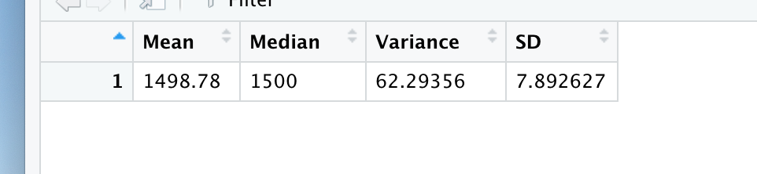

# MechaCar_Statistical_Analysis
R Analysis of AutoRUs' newest MechaCar Prototype to identify insights in manufacturing issues. 

# Deliverables

## Deliverable 1: Linear Regression to Predict MPG

### Which variables/coefficients provided a non-random amount of variance to the mpg values in the dataset?

The variables that provide a non-random amount of variance in mpg are the vehicle length and ground clearance, which both show a a significant p-value that is smaller than 0.001. This means that the vehicle length and ground clearance have a significant impact on the mpg that the car is able to achieve. Vehicle weight, spoiler angle, and AWD do not have a significant impact on mpg. 

### Is the slope of the linear model considered to be zero? Why or why not?

The slope of the linear model is not considered to be zero. The r-squared value can help indicate what the slope of the linear model would be and the p-value can help indicate if the slope is significantly different than 0 or not. In this case, the r-squared value is 0.7149, meaning that the r value or slope of the linear model is 0.85. To find the value of r you square root the value of r-squared. This is a large positive relationship between the variables and an increase in miles per gallon. It is a significant effect because the p-value is less much lower than 0.001 at 5.35e-11. 

### Does this linear model predict mpg of MechaCar prototypes effectively? Why or why not?

As with any linear model, there is some ability to predict mpg based on the linear regression that was calculated, though some limits exist. In this case, there is an r-squared value of 0.7149, meaning that 71.49% of the variation in miles per gallon can be accounted for due to variance in the given variables. It is a significant effect because the p-value is less much lower than 0.001 at 5.35e-11. It is a significant effect because the p-value is less much lower than 0.001 at 5.35e-11. This also means that 28.5% or variation in miles per gallon can be accounted for with other unknown variables. The model is somewhat predictive but will not be perfectly accurate. 

## Deliverable 2: Summary Statistics on Suspension Coils

### The design specifications for the MechaCar suspension coils dictate that the variance of the suspension coils must not exceed 100 pounds per square inch. Does the current manufacturing data meet this design specification for all manufacturing lots in total and each lot individually? Why or why not?

When all of the data is analyzed together, the variance of the coils is less than 100 pounds per inch and appear to pass the manufacturing specifications. When we separate the 3 different lots and analyze the variance of each separately, we find that lot 1 and lot 2 are well within the limits of 100 pounds per (variance = 0.98 and 2.73 respectively).

Lot 3 however is way outside of the bounds of normal variance with a pounds per square inch variance of 170.29. This indicates that there is some manufacturing error that needs to be addressed. 

## Deliverable 3: T-Test on Suspension Coils

### Briefly summarize your interpretation and findings for the t-test results. Include screenshots of the t-test to support your summary.

After separating the Suspension Coil data into groups based on the lot number, we analyzed the average mean PSI for each lot compared to the population average to 1500 PSI. We found that Lot 1 and Lot 2 are within the normal range of variation from the mean. Lot 1 had an average PSI of 1500, Lot 2 had an average of 1500.2, both of which had a p-value of larger than 0.05, meaning that they were within two standard deviation of the mean and within the normal range of variation expected from a sample. 

Lot 3 however had a mean of 1496.14, which had a p-value of 0.042 which is less than 0.05, indicating that the mean is outside of 2 standard deviations from the population mean, is significantly smaller than the population mean, and can be considered an outlier. This indicated that further analysis should be done to see why Lot 3 is outside of the normal range for the average PSI.  

## Deliverable 4: Design a Study Comparing the MechaCar to the Competition

### Write a short description of a statistical study that can quantify how the MechaCar performs against the competition. In your study design, think critically about what metrics would be of interest to a consumer: for a few examples, cost, city or highway fuel efficiency, horsepower, maintenance cost, or safety rating.

In order to compare the performance of MechaCar against their competition, there are many things that should be considered. What criteria you want to compare would depend on what your expected outcome might be. If you believe that MechaCar will be a more affordable vehicle than other cars in similar categories then you could focus on initial price, average mpg and maintenance costs (ongoing costs), and resale values after a set period of time. If you want to compare the performance of MechaCar against similar vehicles, you could compare acceleration time to 60mph, horsepower, stopping power, responsiveness, etc. For my study I will focus on the affordability of MechaCar when compared to other similar vehicles. 

#### What metric or metrics are you going to test?
- I will compare the average purchase price of MechaCar against similar vehicles from other manufacturers. I will also compare the annual cost of maintenance, and the average miles per gallon (both highway and city). Then I will look at the average resale value of the vehicles 5 years after manufacture date. 

#### What is the null hypothesis or alternative hypothesis?
        - Test 1 
                - Null-1 : There is no difference in the average purchase price of a MechaCar and other similar vehicles. 
                - Alternative-1 : The average purchase price of a MechaCar is significantly lower than that of similar vehicles. 

        - Test 2 
                - Null-2 : There is no difference in the annual maintenance costs of MechaCar and similar vehicles. 
                - Alterntive-2 : There is a difference in the annual maintenance costs of MechaCar and similar vehicles.

        - Test 3
                - Null-3 : There is no difference in the average mpg of MechaCar and average mpg of similar vehicles. 
                - Alterntive-3 : There is no difference in the average mpg of MechaCar and average mpg of similar vehicles.

        - Test 4
                - Null-4 : There is no difference in the average resale price of a MechaCar and other similar vehicles at 5 years after the date of manufacture. 
                - Alternative-4 : The average purchase resale price of a MechaCar is significantly higher than that of similar vehicles at 5 years after the date of manufacture. 

#### What statistical test would you use to test the hypothesis? And why?
Test 1 - One way T-Test if compared to one other vehicle since there is a directional hypothesis (MechaCar is lower). 
        - If you wanted to compart to 2 or more vehicles you would want to do an ANOVA with Post hoc tests to identify specific differences in groups. 
        
Test 2 - Regular T-Test if compared to one other vehicle since there is not a directional hypothesis. 
        - If you wanted to compart to 2 or more vehicles you would want to do an ANOVA with Post hoc tests to identify specific differences in groups. 

Test 3 - Regular T-Test if compared to one other vehicle since there is not a directional hypothesis. 
        - If you wanted to compart to 2 or more vehicles you would want to do an ANOVA with Post hoc tests to identify specific differences in groups. 

Test 4 - One way T-Test if compared to one other vehicle since there is a directional hypothesis (MechaCar is higher). 
        - If you wanted to compart to 2 or more vehicles you would want to do an ANOVA with Post hoc tests to identify specific differences in groups. 

### What data is needed to run the statistical test?
For these statistical tests I will need the following data: 
Test 1 - Average purchase price for MechaCar and other similar vehicles. Ideally this would be a large dataset that is pulling data from dealerships in all 50 states. 

Test 2 - Average maintenance price for MechaCar and other similar vehicles. Ideally this would be a large dataset that is pulling data from dealerships, auto shops, or research groups that represent all 50 states. 

Test 3 - Average mpg for MechaCar and other similar vehicles. Ideally this would be for both average city mpg and highway mpg. This could be pulled from the manufacturers though that may not be as accurate as generating the data with large samples of vehicles. 

Test 4 - Average resale value price for MechaCar and other similar vehicles. Ideally this would be a large dataset that is pulling data from dealerships, Kelly bluebook, craigslist, and other car resale sites in all 50 states.

